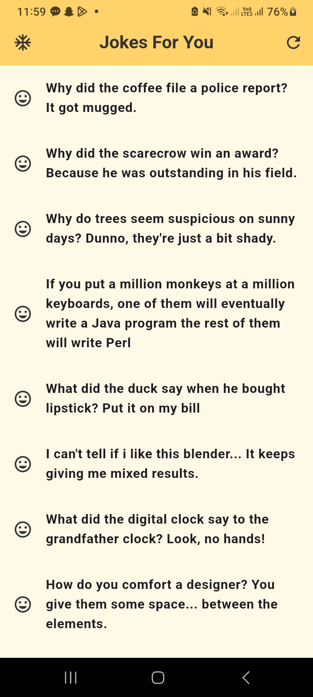
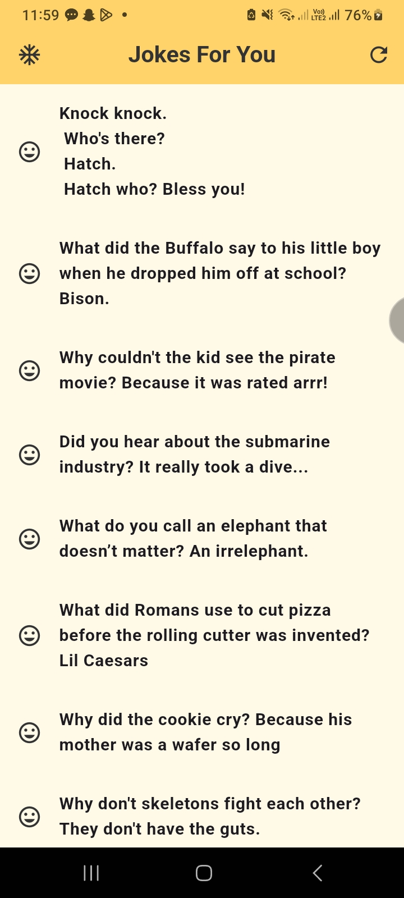

---

# **Jokes App**

A Flutter-based mobile application that fetches and caches jokes from an external API, ensuring a seamless experience in both online and offline modes.

---

## **Features**

- Fetches random jokes from the [Official Joke API](https://official-joke-api.appspot.com/random_ten).
- Caches jokes locally using the `shared_preferences` package for offline access.
- Refresh jokes with a single tap for new content.
- User-friendly interface with dynamic loading indicators and error handling.

---

## **Technical Overview**

- **State Management:** Managed using `FutureBuilder` and `setState`.
- **Caching:** Uses `shared_preferences` for persistent storage of jokes when offline.
- **Networking:** Fetches jokes via `http` package and handles JSON serialization/deserialization.

---

## **Getting Started**

### Prerequisites
- Flutter SDK installed (version 3.10 or higher recommended).
- A code editor (e.g., VS Code, Android Studio).
- Internet connectivity to fetch jokes for the first time.

### Installation
1. Clone the repository:
   ```bash
   git clone https://github.com/chamodlw/jokes_app.git
   ```
2. Navigate to the project directory:
   ```bash
   cd jokes_app
   ```
3. Install dependencies:
   ```bash
   flutter pub get
   ```
4. Run the app:
   ```bash
   flutter run
   ```

---

## **Folder Structure**
```
jokes_app/
├── lib/
│   ├── main.dart             # App entry point
│   ├── screens/              # UI screens
│   │   └── jokes_screen.dart # Screen to display jokes
│   ├── services/             # API handling
│   │   └── api_service.dart  # API fetch logic
│   ├── utils/                # Utility helpers
│       └── cache_helper.dart # Caching functions
├── pubspec.yaml              # Dependencies configuration
```

---

## **Dependencies**
- [Flutter](https://flutter.dev/) - Mobile app development framework.
- [http](https://pub.dev/packages/http) - For handling API requests.
- [shared_preferences](https://pub.dev/packages/shared_preferences) - For local caching.

---

## **How to Use**
1. Launch the app on a device or emulator.
2. The app will display 5 random jokes fetched from the API.
3. If offline, cached jokes will be displayed.
4. Tap the refresh button in the top-right corner to fetch new jokes.

---

## **Screenshots**
 

---

## **Future Improvements**
- Add pagination for displaying more jokes.
- Enable users to mark jokes as favorites.
- Implement a search feature to find specific jokes.

---

## **License**


### **Author**
Developed by [Chamod Weerasinghe](https://chamodweerasinghe.vercel.app/).  
Feel free to reach out for collaboration or feedback!  

---
